<h1 align="center">The Upshot. Galway Film Club. </h1>
 
[View the live project here.](http://the-upshot-ms3.herokuapp.com/index)
 
This is a presentation website for Milestone Project three with Code Institute. This project will focus on data centric development utilising tools such as MongoDb.
 
The Upshot is a website for a local film club. Users will be able to create a profile, log in, read reviews,  search for films by title and upload their own content to the site.
 
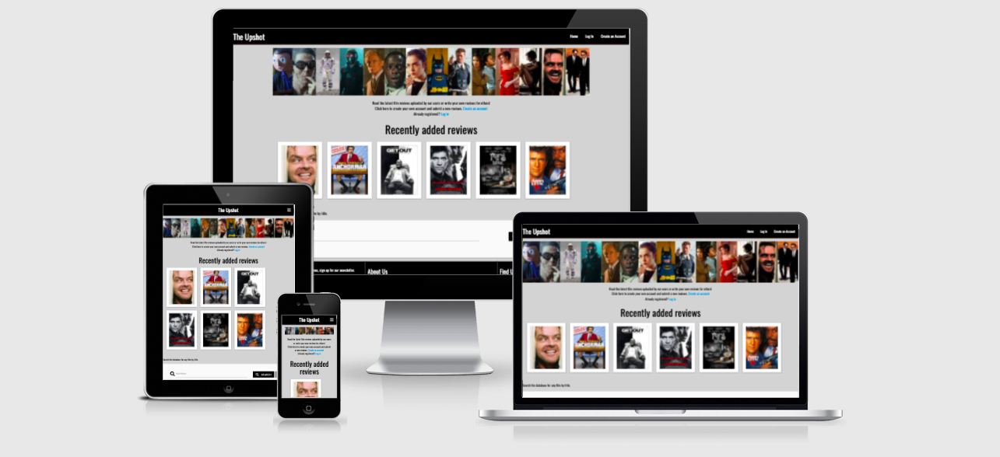
 
## User Experience (UX)
 
-  ### User stories
 
   -  #### First Time Visitor Goals
 
       1. As a First Time Visitor, I want to learn about The Upshot and what they do.
       2. As a First Time Visitor, I want to be able to search the film content on the site.
       3. As a First Time Visitor, I want to see what social media following they have.
 
   -  #### Returning Visitor Goals
 
       1. As a Returning Visitor, I want to create a user account.
       2. As a Returning Visitor, I want to find a specific film to read the reviews.
       3. As a Returning Visitor, I want see my profile page.
 
   -  #### Frequent User Goals
       1. As a Frequent User, I want to upload my own reviews to the website.
       2. As a Frequent User, I want to check for the latest reviews posted by other users.
       3. As a Frequent User, I want to sign up to the Newsletter so that I can hear about film news and any upcoming events.
 
-  ### Design
   -  #### Colour Scheme
       -   The two main colours used are Black and White, keeping in tone with the filmic aesthetic. the site is colourful from the content being uploading by the users so the backgrounds are kept neutral to not create to much noise on the page. 
 
   -  #### Typography
       -   The primary font used is Oswald, this clean crisp modern font looks great black on white, is easy to read and in keeping with the modern, stylish feel of the site.
 
   -  #### Imagery
       -   The imagery will be primarily images from each of the films posted in the database. The banner image was created by myself using Canva.  
 
*  ### Wireframes
 
   -   Home Page Wireframe - [View](static/images/README_images/Upshot wireframe.png)
 
   -   Mobile Wireframe - [View](static/images/README_images/upshot_mobile_wireframe.png)
 
## Features
 
-   Responsive on all device sizes
 
-   Interactive elements

-   Ability to create, locate, display, edit and delete records. 

-   Data Model. 
 
### Languages Used
 
-   [HTML5](https://en.wikipedia.org/wiki/HTML5)
-   [CSS3](https://en.wikipedia.org/wiki/Cascading_Style_Sheets)
-   [Javascript](https://en.wikipedia.org/wiki/JavaScript)
-   [Python](https://en.wikipedia.org/wiki/Python)
 
### Frameworks, Libraries & Programs Used
 
1. [Bootstrap 4.4.1:](https://getbootstrap.com/docs/4.4/getting-started/introduction/)
   - Bootstrap was used to assist with the responsiveness and styling of the website.
2. [Materialise:](https://materializecss.com/)
   - Materialise was used as the frame work for different areas such as the nav bar and my reviews collapsible menu. 
3. [Google Fonts:](https://fonts.google.com/)
   - Google fonts were used to import the 'Titillium Web' font into the style.css file which is used on all pages throughout the project.
4. [Font Awesome:](https://fontawesome.com/)
   - Font Awesome was used on all pages throughout the website to add icons for aesthetic and UX purposes.
5. [jQuery:](https://jquery.com/)
   - jQuery came with Bootstrap to make the navbar responsive but was also used for the smooth scroll function in JavaScript.
6. [Git](https://git-scm.com/)
   - Git was used for version control by utilizing the Gitpod terminal to commit to Git and Push to GitHub.
7. [GitHub:](https://github.com/)
   - GitHub is used to store the projects code after being pushed from Git.
8. [Canva:](https://www.canva.com/en_gb/)
   - Canva was used to create the logo, resizing images and editing photos for the website.
9. [Balsamiq:](https://balsamiq.com/)
   - Balsamiq was used to create the [wireframes](https://github.com/) during the design process.
10. [MongoDB:](https://www.mongodb.com/cloud/atlas)
   - MongoDB was used to create the database.
11. [Heroku:](https://dashboard.heroku.com/login)
   - Heroku was used to deploy the application.


## Testing
 
The W3C Markup Validator and W3C CSS Validator Services were used to validate every page of the project to ensure there were no syntax errors in the project.

[W3C CSS Validator](https://jigsaw.w3.org/css-validator/#validate_by_input) - 
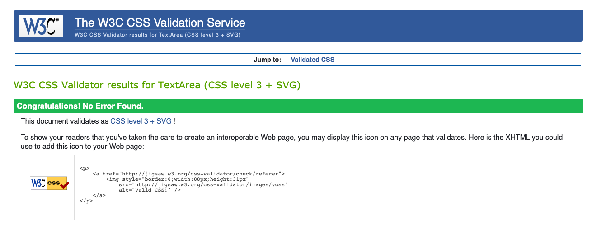

[HTML Validator](https://validator.w3.org/) As jinga was used in the HTML this file was tested by viewing the Page Source and then copying the code into the validator via direct input. 

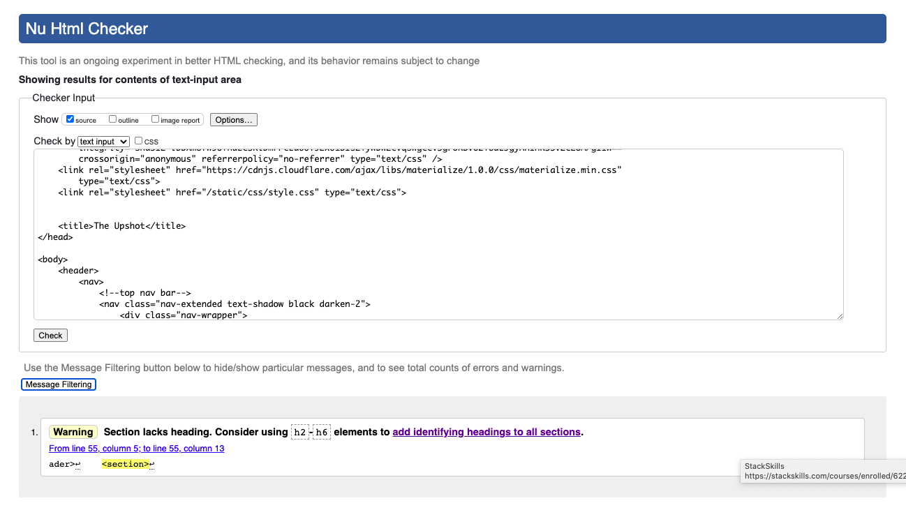
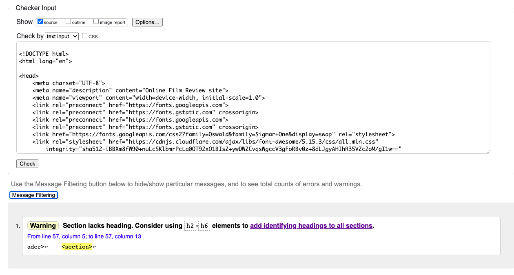
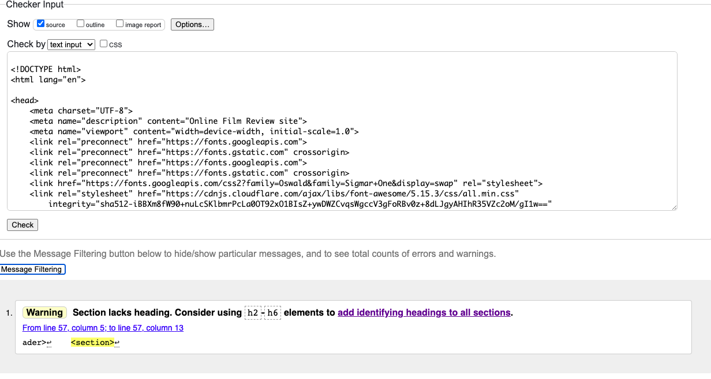
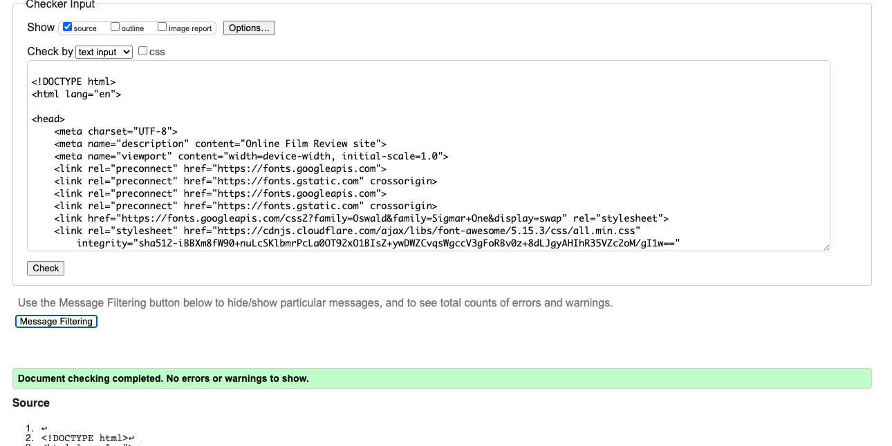
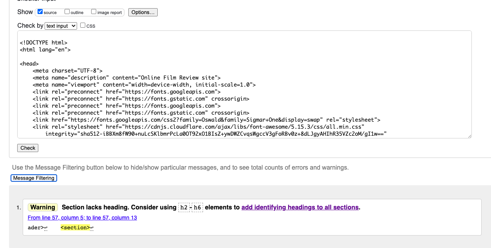
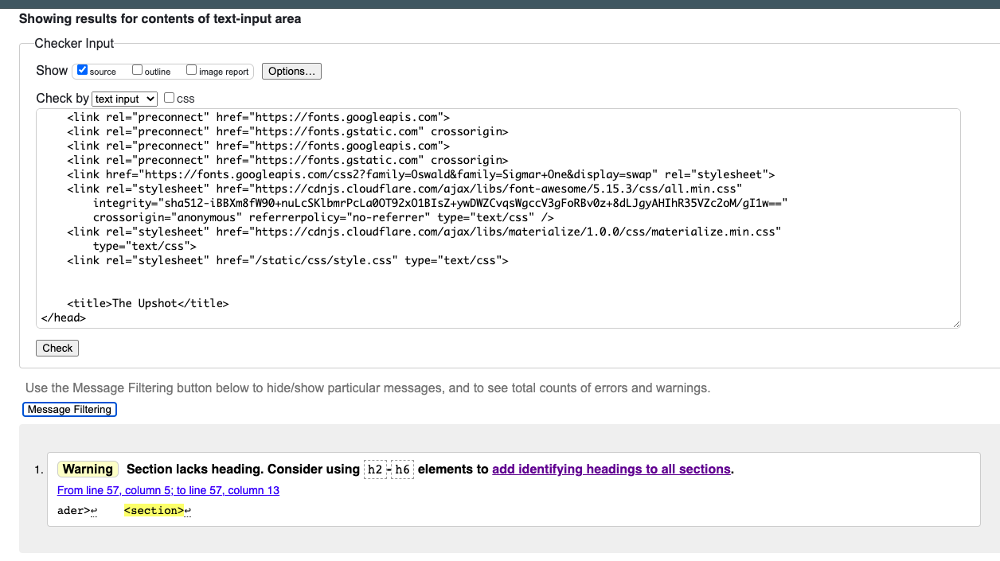

[PEP8 Online Checker](http://pep8online.com/checkresult)
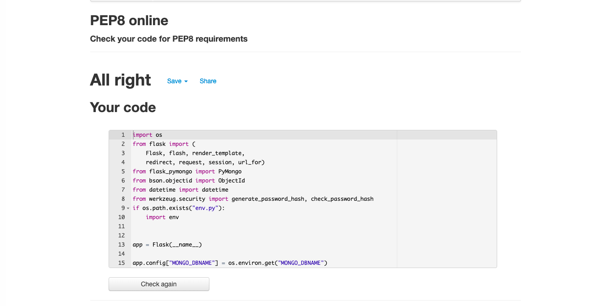


[Google Lighthouse Score test](https://developers.google.com/web/tools/lighthouse)
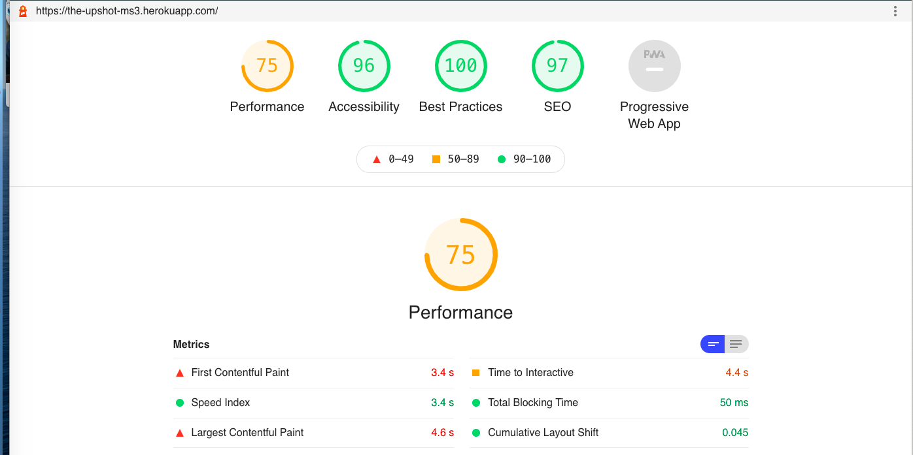

The performance score is lower we would liek to see here but on further review this is becuase the images are sourced via linkes from third party sites and not actually affecting the performance of our site. 

Email to personal account testing newsletter subscription
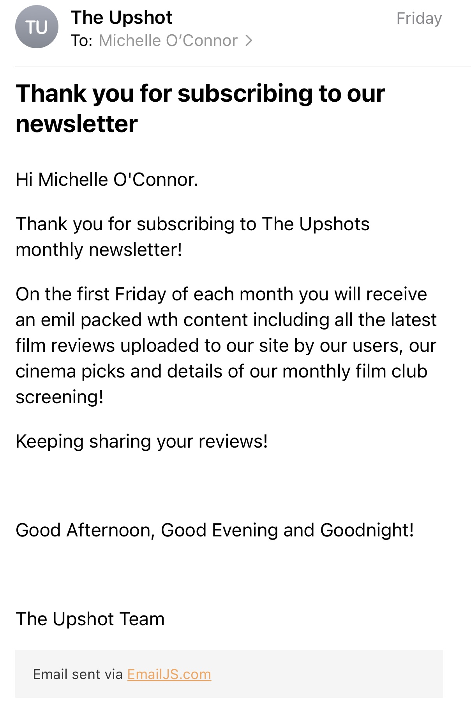
 
### Testing User Stories from User Experience (UX) Section
 
-  #### First Time Visitor Goals
 
  1. As a First Time Visitor, I want to learn about The Upshot and what they do.
    
       1. Upon entering the site, users are automatically greeted with a clean and easily readable navigation bar to go to the page of their choice. Underneath there is a Hero Image followed by text inviting users to log in our create and account. 2. The footer contains an About Us section to learn more about the organisation. 
       3. The pages and blocks of text were kept minimal to make it very clear what the site represents. 
 
   2.  As a First Time Visitor, I want to be able to search the film content on the site.
     
       1. The site has been designed to be fluid and never to entrap the user. At the top of each page there is a clean navigation bar, each link describes what the page they will end up at clearly.
       2. The most recent reviews are front and centre on the home page and reviews can be read by just clicking on the image. the search bar allows users to type in any film they are looking for. 
       3. The users profile page keeps a visible list fo their uploaded content. 
 
   3.  As a First Time Visitor, I want to see what social media following they have.
 
       1. Links to all The Upshots social media pages is visible in the footer. 
       
 
-  #### Returning Visitor Goals
 
   1. As a Returning Visitor, I want to create a user account.
  
       1. The main navigation bar and the text under the hero image include links for new users to navigate to the create an account page. 
       2.Once a username and password has been chosen, users will redirect to their own profile page. 
 
   2.  As a Returning Visitor, I want to find a specific film to read the reviews.
 
       1. The home page contain a search bar that will allow users to type in the film title they are looking for and search the entire database. If a result is found, a film card will open under the search bar. If not, a flash message of 'no results found' will be displayed. 
 
   3.  As a Returning Visitor, I want to see my profile page. 
        1. Once the returning user creates the account. They will be redirected to their profile page and then going forward everytime they log in they will redirect to their profile page. 
      
 
-  #### Frequent User Goals
 
   1. As a Frequent User, I want to upload my own reviews to the website
 
       1. Users who are logged in will see a new navigation bar that includes 'upload your review' where they can add their own content. Once added, this will live on their profile page and can be edited, deleted when they wish. 
 
   3. As a Frequent User, I want to sign up to the Newsletter so that I can hear about film news and any upcoming events.
 
      1. The footer contains a block telling users if they would like to hear about live events they can sign up for the newsletter. By entering their name and email address and clicking 'subsribe' they will automatically receive a thanks for subscribing email and details about the newsletter. 
 
### Further Testing
 
-   The Website was tested on Google Chrome, Internet Explorer, Microsoft Edge and Safari browsers.
-   The website was viewed on a variety of devices such as Desktop, Laptop, iPhone7, iPhone 8 & iPhoneX.
-   A large amount of testing was done to ensure that all pages were linking correctly.
-   Friends and family members were asked to review the site and documentation to point out any bugs and/or user experience issues.
 
### Known Bugs
 
-   On some mobile devices the Hero Image pushes the size of screen out more than any of the other content on the page.
   -   A white gap can be seen to the right of the footer and navigation bar as a result.
-   On Microsoft Edge and Internet Explorer Browsers, all links in Navbar are pushed upwards when hovering over them.
 
## Deployment
 
### GitHub Pages
 
The project was deployed to GitHub Pages using the following steps...
 
1. Log in to GitHub and locate the [GitHub Repository](https://github.com/)
2. At the top of the Repository (not top of page), locate the "Settings" Button on the menu.
   - Alternatively Click [Here](https://raw.githubusercontent.com/) for a GIF demonstrating the process starting from Step 2.
3. Scroll down the Settings page until you locate the "GitHub Pages" Section.
4. Under "Source", click the dropdown called "None" and select "Master Branch".
5. The page will automatically refresh.
6. Scroll back down through the page to locate the now published site [link](https://github.com) in the "GitHub Pages" section.
 
### Forking the GitHub Repository
 
By forking the GitHub Repository we make a copy of the original repository on our GitHub account to view and/or make changes without affecting the original repository by using the following steps...
 
1. Log in to GitHub and locate the [GitHub Repository](https://github.com/)
2. At the top of the Repository (not top of page) just above the "Settings" Button on the menu, locate the "Fork" Button.
3. You should now have a copy of the original repository in your GitHub account.
 
### Making a Local Clone
 
1. Log in to GitHub and locate the [GitHub Repository](https://github.com/)
2. Under the repository name, click "Clone or download".
3. To clone the repository using HTTPS, under "Clone with HTTPS", copy the link.
4. Open Git Bash
5. Change the current working directory to the location where you want the cloned directory to be made.
6. Type `git clone`, and then paste the URL you copied in Step 3.
 
```
$ git clone https://github.com/YOUR-USERNAME/YOUR-REPOSITORY
```
 
7. Press Enter. Your local clone will be created.
 
```
$ git clone https://github.com/YOUR-USERNAME/YOUR-REPOSITORY
> Cloning into `CI-Clone`...
> remote: Counting objects: 10, done.
> remote: Compressing objects: 100% (8/8), done.
> remove: Total 10 (delta 1), reused 10 (delta 1)
> Unpacking objects: 100% (10/10), done.
```
 
Click [Here](https://help.github.com/en/github/creating-cloning-and-archiving-repositories/cloning-a-repository#cloning-a-repository-to-github-desktop) to retrieve pictures for some of the buttons and more detailed explanations of the above process.
 
## Credits
 
### Code
 
-   The full-screen hero image code came from this [StackOverflow post](https://stackoverflow.com)
 
-   [Bootstrap4](https://getbootstrap.com/docs/4.4/getting-started/introduction/): Bootstrap Library used throughout the project mainly to make site responsive using the Bootstrap Grid System.
 
-   [MDN Web Docs](https://developer.mozilla.org/) : For Pattern Validation code. Code was modified to better fit my needs and to match an Irish phone number layout to ensure correct validation. Tutorial Found [Here](https://developer.mozilla.org/en-US/docs/Web/HTML/Element/input/tel#Pattern_validation)
 
### Content
 
-   All content was written by the developer.
 
-   Psychological properties of colours text in the README.md was found [here](http://www.colour-affects.co.uk/psychological-properties-of-colours)
 
### Media
 
-   All Images were created by the developer.
 
### Acknowledgements
 
-   My Mentor for continuous helpful feedback.
 
-   Tutor support at Code Institute for their support.


